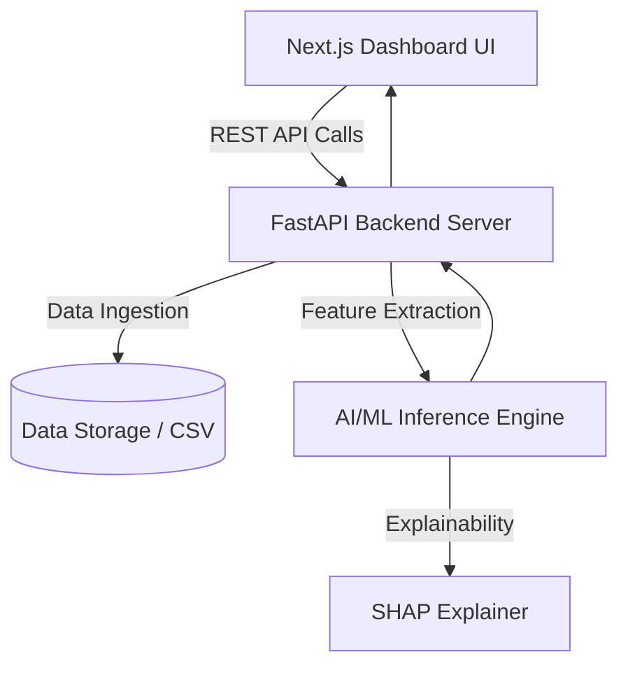
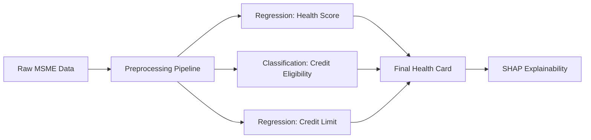

# Solution Architecture: MSME Financial Health Card

## 1. End-to-End System Architecture

The solution uses a modern, scalable architecture divided into three tiers:

### Components:
- **Frontend**: A React-based Next.js application that provides an intuitive dashboard for loan officers and relationship managers.
- **Backend API**: A Python-based FastAPI service that orchestrates the flow of data, handles incoming requests, and serves model predictions in real-time.
- **AI/ML Engine**: Scikit-learn pipelines and XGBoost models that predict the financial health score, credit eligibility, and recommended credit limits.

## 2. Data Ingestion Pipeline

The data ingestion pipeline takes raw alternative data from various sources (GST, UPI, Banking) and standardizes it.
1. **Raw Data Handling**: Data is ingested via the `/api/ingest` endpoint.
2. **Preprocessing**: Missing values are imputed (e.g., using median strategies for numeric features) and categorical features are encoded using One-Hot Encoding.
3. **Scaling**: Numeric features are scaled using `StandardScaler` to ensure the machine learning models treat features fairly.

## 3. AI/ML Workflow

- **Feature Engineering**: Utilizing alternative data like `Monthly_UPI_Inflow_INR`, `GST_Filing_Timeliness_Pct`, and `Cashflow_Stability_Index`.
- **Model Training**: XGBoost is used for its high performance on tabular data, capturing non-linear relationships and feature interactions effectively.
- **Explainability**: SHAP (SHapley Additive exPlanations) is integrated to explain individual predictions, showing exactly which features drove the score up or down for a specific MSME.

## 4. Technology Stack

- **Data Science**: Python, Pandas, NumPy, Scikit-learn, XGBoost, SHAP
- **Backend & APIs**: FastAPI, Pydantic, Uvicorn
- **Frontend & UI**: Next.js (React), TypeScript, Tailwind CSS, Recharts (for data visualization)
- **Deployment Strategy**: Containerization via Docker, scalable on cloud platforms (e.g., AWS ECS, Google Cloud Run) with a managed PostgreSQL database.
